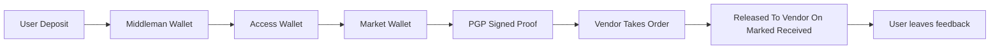

# TorZon Darknet | Official Resources - TorZon URL 

 

### TORZON URL 

: 

``` 

torzonzau4bdfi5cdzneuyp4r4ybmet5qpbc3vxuvlweoedl4xqdllyd.onion 

``` 

 

 

## Table of Contents 

- [Market Info](#market-info) 

- [Tech Infrastructure](#tech-infrastructure) 

- [Security Features](#security-features) 

- [Access Guide](#access-guide) 

- [OP Framework](#op-framework) 

- [Ethical Guidelines](#ethical-guidelines) 

 

## Market Information 

Torzon Market hased emerged in late 2022 as one of the most specialized e-commerce platform operating in the Tor anonymous network. Designed as the privacy-focused marketplace you always needed, it employs distributed server infrastructure across multiple networks. The platform features: 

- Staff multi-account market model with secure escrow services 

- Monero and Bitcoin transactions (BTC/XMR) 

- Vendor reputation system with user feedback 

- Automated dispute resolution system 

- Regular mirror updates to maintain security 

 

## Tech Infrastructure 

**Core Architecture:** 

- Distribution nodes across 7+ global networks 

- Load balancing entry points with automatic failover 

- PostgreSQL database server with Luks FDE (full disk encryption) 

- Asynchronous worker processing for transactions 

- PGP 2fa authentication system 

 

## Security Feautres 

**User Protection Measures:** 

- Two-factor authentication with time based session tokens 

- Hierarchical wallet system 

- Multi-sig escrow requiring 2/3 signers 

- Automatic session termination after specified time 

 

## Access Guide 

### Essential Software: 

1. **Tor Browser** required 

- JavaScript disable required 

2. **Cryptocurrency Wallet** (Electrum/Wasabi/Monero GUI) 

- Must support SegWit wallet addresses 

- Coin-control recommended for users 

 

## Op Framework 

**Transaction Workflow:** 



 

**Torzon URL Metrics:** 

- Registered User: 300,000 

- Active Sellers: 6000 

- Active Buyers: 150,000 

- Uptime: 99% 

 

## Ethical Guidelines 

This repo is provided for educational purposes. Note: 

- Accessing the darknet is not illegal, doing illegal things on it is. 

- Practive ethical guidelines when accessing TorZon Link. 

 

> **Disclaimer**: This repo is purely fictional and designed for the TV show "TorZon: The Web To Be

